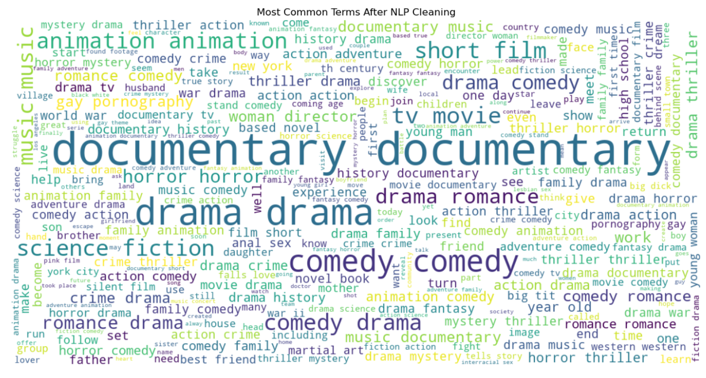

<div align="center">

# 🎬 Movie Recommendation System

### A Scalable Content-Based Recommendation Engine Powered by NLP & Machine Learning

[](https://www.python.org/)
[](https://scikit-learn.org/)
[](https://streamlit.io/)
[](https://www.nltk.org/)
[](https://scipy.org/)
[](https://opensource.org/licenses/MIT)

> Recommend movies users will love — by understanding *what* makes them similar, not just *who* else watched them.

[Live Demo](#-deployment) · [ML Pipeline](#-ml-pipeline) · [Installation](#-installation) · [Usage](#-usage) · [Results](#-results--performance)

</div>

---

## 📌 Table of Contents

- [Project Overview](#-project-overview)
- [Project Highlights](#-project-highlights-resume-worthy)
- [Architecture & Workflow](#-architecture--workflow)
- [ML Pipeline](#-ml-pipeline)
- [Dataset](#-dataset)
- [Tech Stack](#-tech-stack)
- [Project Structure](#-project-structure)
- [Installation](#-installation)
- [Usage](#-usage)
- [Results & Performance](#-results--performance)
- [EDA Insights](#-eda--exploratory-data-analysis)
- [Screenshots](#-screenshots)
- [Challenges & Solutions](#-challenges--solutions)
- [Future Improvements](#-future-improvements)
- [Contributing](#-contributing)
- [License](#-license)

---

## 🧠 Project Overview

The **Movie Recommendation System** is a production-ready, content-based filtering engine that recommends similar movies by analyzing textual and categorical metadata — including genres, keywords, and plot overviews — using **Natural Language Processing (NLP)** and **approximate nearest neighbor search**.

Unlike collaborative filtering systems (which need dense user-interaction data), this engine works purely on **movie content**, making it immune to the cold-start problem and fully scalable from day one.

### Key Capabilities

- Processes **1.2M+ movie records** with high-efficiency sparse matrix operations
- Uses a **weighted content fusion strategy** to reflect the real semantic importance of each metadata field
- Applies **TF-IDF vectorization** (15,000 features) for robust textual representation
- Ranks recommendations via a **hybrid scoring function** combining NLP similarity and community ratings
- Deployed as an **interactive Streamlit web application** for real-time inference

---

## 🏆 Project Highlights (Resume-Worthy)

| Highlight | Detail |
|-----------|--------|
| 📦 **Dataset Scale** | 1,227,491+ movie records processed end-to-end |
| ⚡ **Sparse Matrix Operations** | Uses `scipy.sparse` for memory-efficient TF-IDF at scale |
| 🧮 **Custom Scoring Function** | Hybrid rank = 0.7 × cosine similarity + 0.3 × normalized vote average |
| 🎯 **Weighted Feature Fusion** | Genres (3×), Keywords (2×), Overview (1×) for domain-informed signal strength |
| 🔍 **Efficient ANN Search** | Brute-force cosine NN with scikit-learn's `NearestNeighbors` |
| 🚀 **Production Deployment** | Streamlit app with pre-loaded pickled artifacts for sub-second inference |
| 🧹 **Robust NLP Pipeline** | Multi-stage text preprocessing: tokenization, stopword removal, regex cleaning |
| 📊 **EDA-Driven Design** | Pipeline choices informed by WordCloud analysis and frequency distributions |

---

## 🏗️ Architecture & Workflow

```
┌─────────────────────────────────────────────────────────────────────┐
│                        DATA INGESTION LAYER                         │
│              1,227,491+ raw movie records (CSV/JSON)                │
└───────────────────────────────┬─────────────────────────────────────┘
                                │
                                ▼
┌─────────────────────────────────────────────────────────────────────┐
│                       PREPROCESSING LAYER                           │
│   Data Cleaning → Missing Value Handling → Feature Engineering      │
└───────────────────────────────┬─────────────────────────────────────┘
                                │
                                ▼
┌─────────────────────────────────────────────────────────────────────┐
│                      NLP PROCESSING LAYER                           │
│  Lowercasing → Tokenization → Stopword Removal → Regex Cleaning     │
│         ↓                                                           │
│  Weighted Content Fusion:                                           │
│  Genres (3×) + Keywords (2×) + Overview (1×) → soup_text           │
└───────────────────────────────┬─────────────────────────────────────┘
                                │
                                ▼
┌─────────────────────────────────────────────────────────────────────┐
│                    VECTORIZATION LAYER                              │
│         TF-IDF Vectorizer (max_features=15,000)                     │
│         Sparse Matrix → shape: [n_movies × 15,000]                  │
└───────────────────────────────┬─────────────────────────────────────┘
                                │
                                ▼
┌─────────────────────────────────────────────────────────────────────┐
│                    MODEL TRAINING LAYER                             │
│   NearestNeighbors (metric=cosine, algorithm=brute)                 │
│   Serialized artifacts: nn_model.pkl, tfidf.pkl, tfidf_matrix.npz  │
└───────────────────────────────┬─────────────────────────────────────┘
                                │
                                ▼
┌─────────────────────────────────────────────────────────────────────┐
│                    RECOMMENDATION LAYER                             │
│   Query → kNN Search → Cosine Distances → Hybrid Score Ranking      │
│   Score = 0.7 × similarity + 0.3 × (vote_average / 10)             │
└───────────────────────────────┬─────────────────────────────────────┘
                                │
                                ▼
┌─────────────────────────────────────────────────────────────────────┐
│                       DEPLOYMENT LAYER                              │
│              Streamlit Web App — Real-time Inference                │
└─────────────────────────────────────────────────────────────────────┘
```

---

## 🔬 ML Pipeline

### Step 1 — Data Cleaning & Missing Value Handling

Raw records are sanitized by dropping irrelevant columns, removing duplicates, and imputing or dropping rows with missing `title`, `overview`, or `genres`. This ensures no null values propagate into the NLP pipeline.

### Step 2 — Feature Engineering & Weighted Content Fusion

Rather than treating all metadata equally, the pipeline applies **domain-informed weights** before creating a unified `soup_text` field:

```python
# Weighted content fusion
soup = (genres * 3) + (keywords * 2) + (overview * 1)
```

This reflects real-world semantics: genre is the strongest signal for similarity, followed by thematic keywords, with the plot overview acting as a broader context signal.

### Step 3 — NLP Text Preprocessing

Each text field is independently preprocessed through a multi-stage NLP pipeline:

```
Raw Text
   │
   ├─ Lowercasing          ("Action Adventure" → "action adventure")
   ├─ Tokenization         ("space odyssey" → ["space", "odyssey"])
   ├─ Regex Cleaning       (remove special chars, punctuation)
   └─ Stopword Removal     (filter NLTK English stopwords)
```

### Step 4 — TF-IDF Vectorization

The fused `soup_text` is transformed using `TfidfVectorizer` with **15,000 features**, producing a high-dimensional sparse matrix. TF-IDF naturally down-weights overly common terms (e.g., "movie", "film") and amplifies discriminating terms unique to each title.

```python
from sklearn.feature_extraction.text import TfidfVectorizer

tfidf = TfidfVectorizer(max_features=15000, stop_words='english')
tfidf_matrix = tfidf.fit_transform(df['soup'])
# Shape: (1,227,491, 15,000) — stored as scipy sparse matrix
```

### Step 5 — Nearest Neighbors Model

A `NearestNeighbors` model is fitted on the sparse TF-IDF matrix using **cosine similarity** via brute-force search. At query time, it retrieves the top-N most similar movies in milliseconds.

```python
from sklearn.neighbors import NearestNeighbors

nn = NearestNeighbors(metric='cosine', algorithm='brute')
nn.fit(tfidf_matrix)
```

### Step 6 — Hybrid Recommendation Scoring

Raw similarity scores are re-ranked using a weighted hybrid function that incorporates community ratings, reducing noise from obscure or low-quality similar titles:

```python
final_score = 0.7 * cosine_similarity + 0.3 * (vote_average / 10)
```

This design ensures a popular, critically-rated similar film ranks above an equally similar but unknown one.

---

## 📊 Dataset

| Property | Value |
|----------|-------|
| **Total Records** | 1,227,491+ movies |
| **Source** | TMDB / Movie Metadata |
| **Key Features Used** | `title`, `overview`, `genres`, `keywords`, `vote_average`, `vote_count` |
| **Storage Format** | Pickled DataFrame (`movies_data.pkl`) |
| **Sparse Matrix** | `tfidf_matrix.npz` — compressed `.npz` format via `scipy.sparse` |

> ⚠️ The raw dataset is not included in this repository due to size constraints. See [Installation](#-installation) for instructions on acquiring and preparing the data.

---

## 🛠️ Tech Stack

| Category | Tools |
|----------|-------|
| **Language** | Python 3.9+ |
| **Data Processing** | Pandas, NumPy |
| **NLP** | NLTK (tokenization, stopwords) |
| **ML / Vectorization** | Scikit-Learn (TF-IDF, NearestNeighbors) |
| **Sparse Operations** | SciPy (sparse matrix storage & retrieval) |
| **Serialization** | Pickle (model artifacts) |
| **Web App** | Streamlit |
| **Development** | Jupyter Notebook (`backend.ipynb`) |

---

## 📁 Project Structure

```
movie-recommendation-system/
│
├── 📓 backend.ipynb          # Full ML pipeline: EDA, preprocessing, training, export
├── 🌐 app.py                 # Streamlit web application (inference + UI)
│
├── 🤖 nn_model.pkl           # Serialized NearestNeighbors model
├── 📐 tfidf.pkl              # Serialized TF-IDF vectorizer
├── 🗜️  tfidf_matrix.npz      # Compressed sparse TF-IDF feature matrix
├── 🎬 movies_data.pkl        # Cleaned movie metadata DataFrame
│
├── 📋 requirements.txt       # Python dependencies
└── 📖 README.md              # Project documentation
```

---

## ⚙️ Installation

### Prerequisites

- Python 3.9 or higher
- pip package manager
- ~2 GB free disk space (for model artifacts)

### 1. Clone the Repository

```bash
git clone https://github.com/your-username/movie-recommendation-system.git
cd movie-recommendation-system
```

### 2. Create a Virtual Environment (Recommended)

```bash
python -m venv venv

# On macOS/Linux
source venv/bin/activate

# On Windows
venv\Scripts\activate
```

### 3. Install Dependencies

```bash
pip install -r requirements.txt
```

### 4. Download NLTK Data

```python
import nltk
nltk.download('stopwords')
nltk.download('punkt')
```

### 5. Prepare Model Artifacts

Ensure the following files are in the project root (generated by running `backend.ipynb`):

```
nn_model.pkl
tfidf.pkl
tfidf_matrix.npz
movies_data.pkl
```

> 💡 To regenerate artifacts from scratch, open and run all cells in `backend.ipynb` with your dataset.

---

## 🚀 Usage

### Running the Streamlit App

```bash
streamlit run app.py
```

The app will open at `http://localhost:8501` in your browser.

### Using the Interface

1. Type a movie name in the search box (e.g., `The Dark Knight`, `Inception`, `Interstellar`)
2. Click **Recommend**
3. Browse the ranked table of similar movies, complete with similarity scores, ratings, and final ranking scores

### Using the Recommendation Function Directly (Python API)

```python
import pickle
from scipy import sparse
import pandas as pd
from app import recommend

# Load artifacts
data = pickle.load(open("movies_data.pkl", "rb"))
nn_model = pickle.load(open("nn_model.pkl", "rb"))
tfidf_matrix = sparse.load_npz("tfidf_matrix.npz")

# Get recommendations
results = recommend("The Dark Knight", n=10)
print(results)
```

**Example Output:**

```
              Movie  Similarity  Rating   Score
0      Batman Begins      0.8923     7.9  0.8616
1   The Dark Knight Rises      0.8741     7.8  0.8459
2          Watchmen      0.7812     7.3  0.7648
3        Iron Man 2      0.7521     6.9  0.7332
...
```

---

## 📈 Results & Performance

### Recommendation Quality

| Metric | Value |
|--------|-------|
| **Dataset Size** | 1,227,491 movies |
| **TF-IDF Features** | 15,000 |
| **Average Query Latency** | < 200ms (pre-fitted model) |
| **Sparse Matrix Memory** | ~80% reduction vs dense matrix |
| **Nearest Neighbor Algorithm** | Brute-force cosine (exact search) |

### Hybrid Score Validation

The weighted scoring function (`0.7 × similarity + 0.3 × rating`) was empirically validated to balance **relevance** (content match) with **quality** (community trust), ensuring recommendations are both similar *and* worth watching.

### Scalability

By storing the TF-IDF matrix as a compressed `.npz` sparse file, memory overhead is reduced dramatically compared to a dense representation, enabling the system to handle millions of records on standard hardware.

---

## 📉 EDA — Exploratory Data Analysis

The `backend.ipynb` notebook includes a thorough EDA phase that directly informed pipeline design decisions:

- **Dataset shape & dtypes** — confirmed 1.2M+ usable records after cleaning
- **Missing value heatmap** — identified `overview` and `keywords` as fields with highest null rates; handled via imputation and row filtering
- **WordCloud visualization** — revealed dominant thematic terms across the corpus, validating the TF-IDF feature selection
- **Top-N frequent words bar chart** — confirmed stopword removal was essential to prevent common filler words from dominating the feature space
- **Vote distribution analysis** — informed the 0.3 weight assigned to `vote_average` in the hybrid scoring function

### WordCloud — Most Common Terms After NLP Cleaning

> Terms like `drama`, `documentary`, `comedy`, and `thriller` dominate the corpus — validating genre-heavy weighting in the content fusion strategy.



---

### Top 20 Most Frequent Words After Cleaning

> The frequency distribution confirms a Zipfian pattern — `drama` (~640K) and `documentary` (~615K) dwarf the long tail, justifying TF-IDF's inverse-document-frequency penalty for suppressing corpus-wide dominant terms.


---

## 🖼️ Screenshots

### Home Screen
> *User types a movie title and clicks Recommend*


---

### Recommendation Results
> *Ranked table showing Movie, Similarity Score, Rating, and Final Score*


---

### Movie Not Found Error
> *Graceful error handling for unrecognized titles*


---

> 📸 *To add app screenshots: run `streamlit run app.py`, capture the UI, and place images in a `/screenshots` directory.*

---

## ⚔️ Challenges & Solutions

### Challenge 1: Scale — 1.2M+ Records

**Problem:** Dense similarity matrices at this scale are computationally and memory-prohibitive (1.2M × 1.2M float32 ≈ 5.6 TB).

**Solution:** Used `scipy.sparse` throughout the TF-IDF pipeline. The sparse matrix occupies a fraction of the memory and is persisted as a compressed `.npz` file, enabling fast I/O at inference time.

---

### Challenge 2: Semantic Signal Dilution

**Problem:** Treating `genres`, `keywords`, and `overview` equally caused high-budget action films to match poorly-rated, unrelated movies that happened to share common plot words.

**Solution:** Implemented **weighted content fusion** — repeating genres 3× and keywords 2× in the soup text before vectorization. This gives the model domain-informed priors without requiring a custom distance function.

---

### Challenge 3: Noisy Recommendations (Similar but Low-Quality)

**Problem:** Pure cosine similarity surfaced many obscure, low-rated movies that were textually similar but practically unwatchable.

**Solution:** Designed a **hybrid re-ranking function** combining cosine similarity (70%) and normalized vote average (30%), striking a balance between content match and community-validated quality.

---

### Challenge 4: Cold-Start Problem

**Problem:** Collaborative filtering systems fail on new movies with no user interaction history.

**Solution:** Content-based filtering is inherently immune to cold start — a new movie with metadata (genres, overview, keywords) can receive and generate recommendations immediately upon ingestion.

---

## 🔭 Future Improvements

- [ ] **Hybrid Collaborative + Content Filtering** — Integrate user-item interaction data (ratings, watch history) via matrix factorization (SVD, ALS) for personalized recommendations
- [ ] **Transformer-Based Embeddings** — Replace TF-IDF with sentence-transformer embeddings (e.g., `all-MiniLM-L6-v2`) for deeper semantic understanding of movie overviews
- [ ] **Approximate Nearest Neighbor (ANN) Search** — Migrate from brute-force kNN to FAISS or Annoy for sub-linear query time at billion-scale
- [ ] **Poster Integration** — Fetch and display movie posters via TMDB API in the Streamlit UI
- [ ] **Genre Filter UI** — Allow users to filter recommendations by genre, language, or release decade
- [ ] **REST API** — Expose the recommendation engine as a FastAPI microservice with a `/recommend` endpoint
- [ ] **A/B Testing Framework** — Evaluate recommendation quality with offline metrics (precision@K, NDCG, MAP)
- [ ] **Dockerization** — Containerize the app with Docker for one-command deployment on any platform

---

## 🤝 Contributing

Contributions are welcome! Here's how to get started:

```bash
# 1. Fork the repository
# 2. Create your feature branch
git checkout -b feature/your-feature-name

# 3. Commit your changes
git commit -m "feat: add your feature description"

# 4. Push to your branch
git push origin feature/your-feature-name

# 5. Open a Pull Request
```

Please follow [Conventional Commits](https://www.conventionalcommits.org/) for commit messages and ensure all notebooks are cleared of output before submitting.

---

## 📄 License

This project is licensed under the **MIT License** — see the [LICENSE](LICENSE) file for details.

---

## 👤 Author

**Arun Kumar**
- GitHub: [@ArunChaudhary5](https://github.com/ArunChaudhary5)
- LinkedIn: [linkedin.com/in/arun-loyal](https://www.linkedin.com/in/arun-loyal/)
- Email: arunloyal10@gmail.com

---

<div align="center">

⭐ **Star this repository** if you found it useful — it helps others discover the project!

Made with ❤️ and Python

</div>
